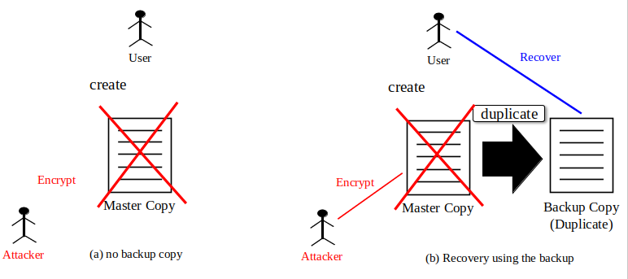
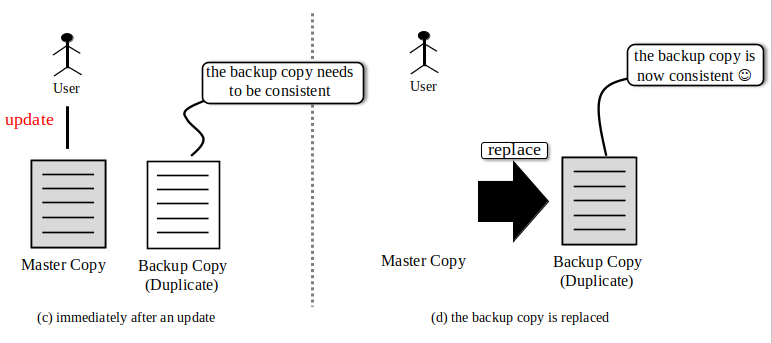

# Problem Definition:

**The proposed idea**: preventing damages from ransomwares by backups

**The problem(s)**: Preventing damages from ransomwares by backups is hard
to do because of some problems.

The following scenario describes the problems.

If there is no backup copy, when a ransomware attacker encrypts the
production master copy, the user will loose access to the contents in
the data (Figure (a). Having a backup copy obviously will prevent this
problem. It is needless to say that, for backups to be an effective
solution for preventing damages from ransomwares, a backup copy should
be created as soon as the master copy of the information is created by
duplicating the contents in the master copy. This way, the backup copy
will be a solution against malicious encryptions by ransomwares. Figure
(b) shows. There is no problem at this point.

In the above setup, it is necessary that each time a user (a legitimate
user) updates logically anything in the production data, the backup copy
should be replaced by the update (it is because, otherwise, the backup
copy is not consistent to the master copy) after (b). Figure (c) and (d)
show this. One of the two major problems is that making an infinitely
large number of backup copies is obviously impossible (i.e., any
commuter systems are finite systems). A possible solution for this issue
would be that, if the contents of the data is updated by a legitimate
user without any malicious intent, all the backup copies can be deleted
except for the most recent backup copy.

The above solution to prevent an infinitely large number of backup
copies raises another question of how we can tell for sure if a
particular update is made by a legitimate user without any malicious
intention, instead of a ransomware. A good solution for this particular
question is quite hard to find because of the following reasons:

(a) Most of the currently known ransomwares encrypt an entire dates or a
    file. Thus, reactive detections may not be hard, but some future
    ransomwares may apply some other methods such as data shuffling or
    data replacement to avoid easy detections especially when the
    defender-side assumes encryptions for the way ransomwares "update"
    the contents in the production data.

(b) Instead of an entire dates (i.e., a file) to be encrypted,
    ransomware attackers may apply "salami-slide method" to gradually
    encrypt production data set. If it is so, the defender side may not
    be lucky enough before they can detect malicious data encryption
    taking place.

## The problem declaration

I am interested in a detection method using AI, machine learning, deep
learning, and even natural language processing that:

(1) Can detect any update (encryptions, obfuscations, and shuffling)
    with malicious internets (for ransoms) [by analyzing how the
    contents in the production data is requested to be updated
    (Note 1)]{.underline}.

(2) It is assumed that none of the existing detection methods proposed
    so far can detect malicious updates:

(a) Can have 0 (zero) false negatives for detection (Note 2)

(b) Can tolerate some (reasonably low) false positives

## Notes

**Note 1**: This topic is my research interest I hope you are
interested.

**Note 2**: Some papers claimed that they developed the detection
methods with zero negative false, but as Harun Oz et.al. concerns ("Many
studies reported perfect TPR (i.e., 100%) that looks over-optimistic",
page 21) \[1\], I (Fujinoki) don't believe that they did (i.e., I agree
with Harun). It is especially because most of the existing ransomwares
are spread as computer viruses, and new viruses are hard to deal with
(attacks from new viruses are called "zero-day viruses, which are never
be seen before at least by security defenders).

I know you are busy and I do not want to overload you even before the
official start of your joint Ph.D. program, if you have just a little
time to spare, I would suggest you to take a look at Section 5.2 of
Harun \[1\] -- even those for "machine-learning based solutions" in that
paper.

## References

\[1\] Harun Oz, Ahmet Aris, Albert Levi, and A. Selcuk Uluagac, "A
Survey on Ransomware: Evolution, Taxonomy, and Defense Solutions", *ACM
Computing Surveys* (CSUR), February 2021.
